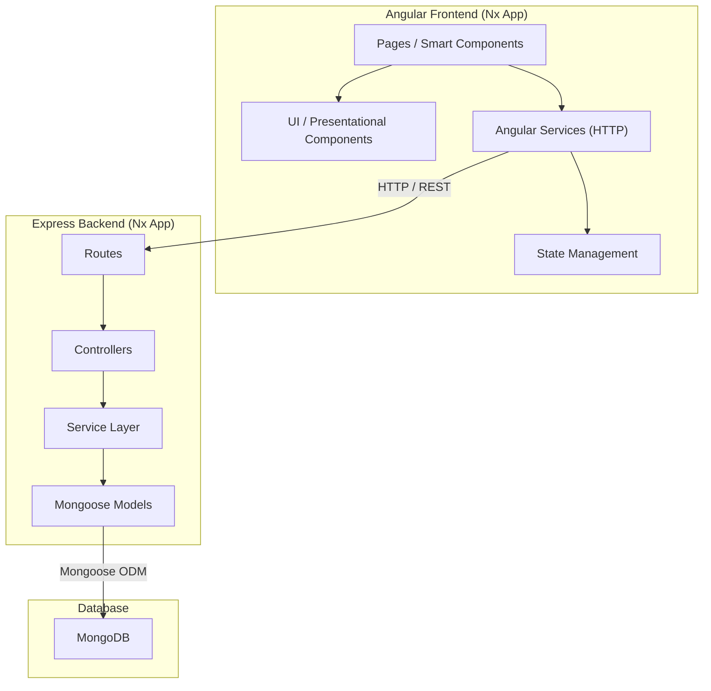
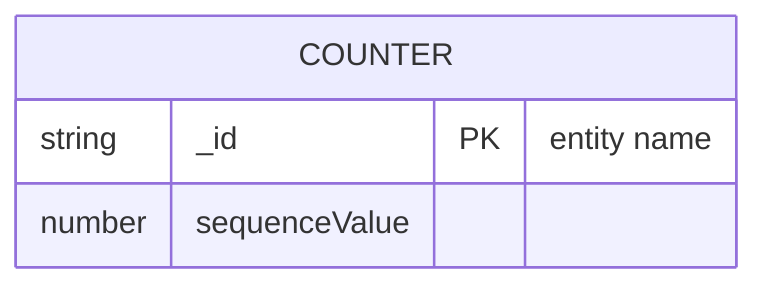
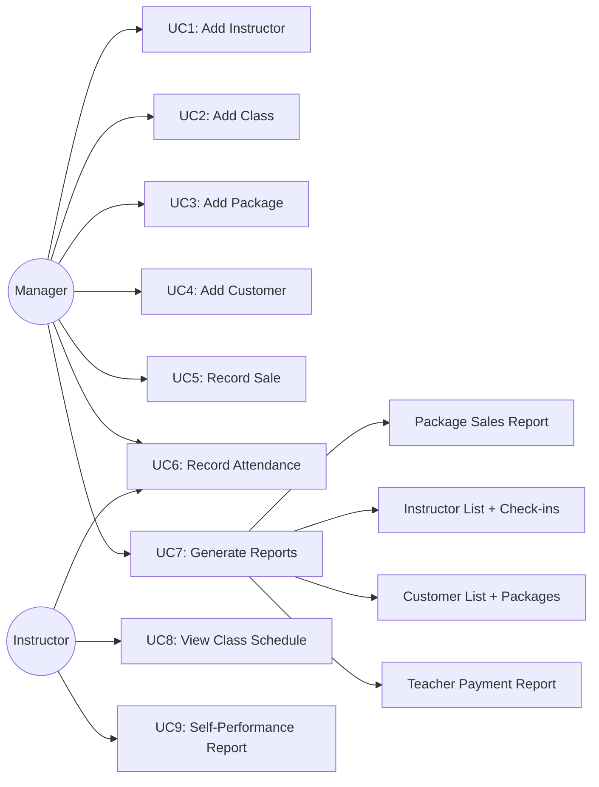
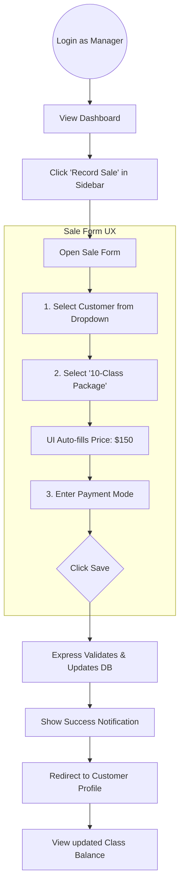
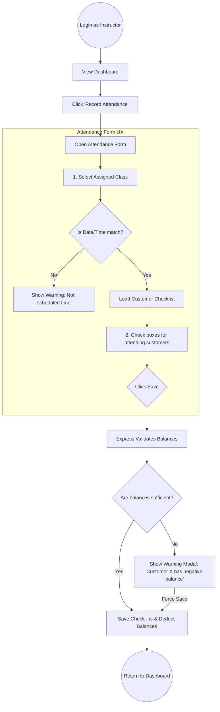
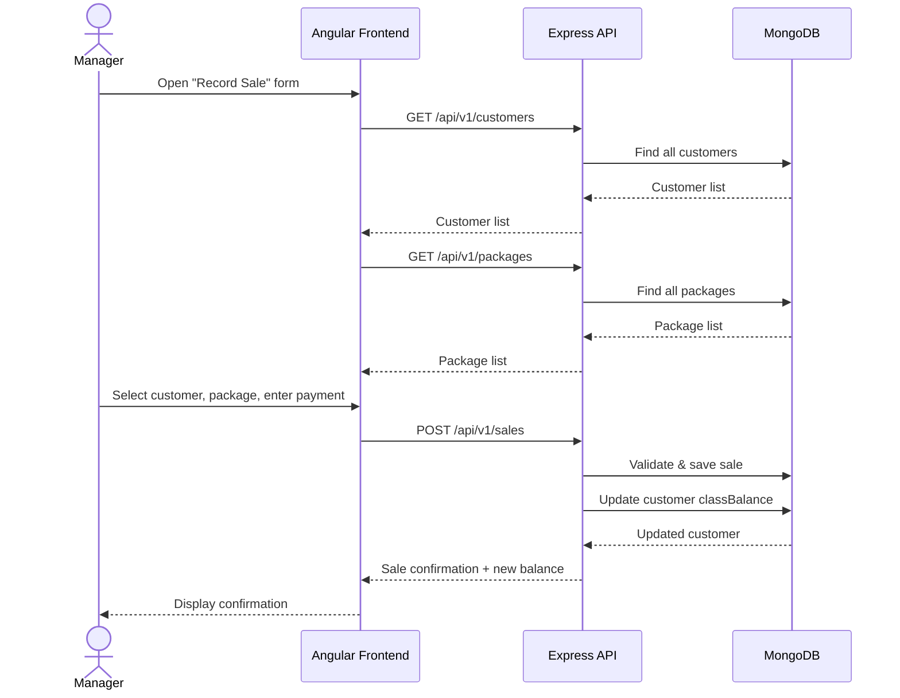
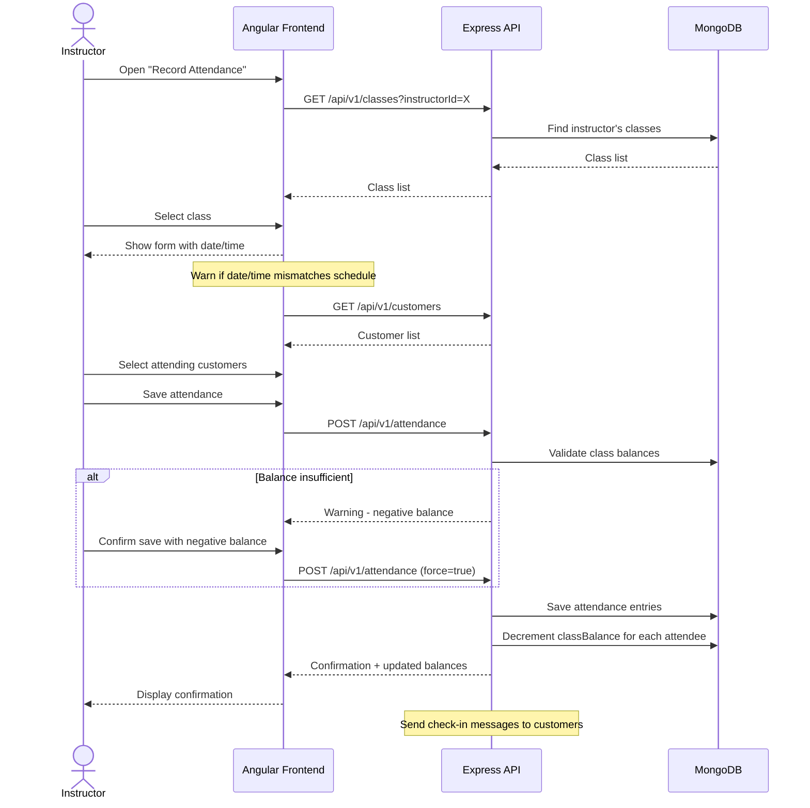
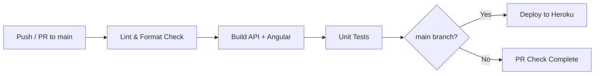

# YogiTrack — Project Plan

> **MEAN Stack (MongoDB · Express · Angular · Node) — Simple Two-Folder Architecture**
>
> A web application to automate the core business processes of Yoga H'om studio:
> instructor & customer management, class scheduling, package sales, attendance tracking, and reporting.

---

## Table of Contents

1. [Project Overview](#1-project-overview)
2. [Architecture](#2-architecture)
3. [Data Models (ERD)](#3-data-models-erd)
4. [Use Cases](#4-use-cases)
5. [API Design](#5-api-design)
6. [Frontend Structure](#6-frontend-structure)
7. [Sequence Diagrams](#7-sequence-diagrams)
8. [Styling Strategy](#8-styling-strategy)
9. [CI/CD & Deployment](#9-cicd--deployment)
10. [Development Phases](#10-development-phases)

---

## 1. Project Overview

| Item | Detail |
|------|--------|
| **Client** | Yoga H'om Studio (Pittsburgh, PA) |
| **Problem** | Manual paper-based record-keeping for classes, attendance, and sales |
| **Solution** | YogiTrack — a full-stack web application automating instructors, customers, packages, scheduling, attendance, and reports |
| **Stack** | MongoDB, Express.js, Angular, Node.js (MEAN) |
| **Structure** | Simple Two-Folder (`frontend/` and `backend/`) |
| **Actors** | Manager, Instructor |
| **License** | PolyForm Noncommercial 1.0.0 |

### Constraints

- **No hardcoding** — all business data (schedules, roles, packages) is served dynamically from Express/MongoDB.
- **Clean modular architecture** — Controllers, Services, Models, Routes (backend); Components, Services, State Management (frontend).
- **Minimalist monochrome UI** — black & white baseline; semantic HTML enabling future theming without logic refactors.
- **Visual documentation** — Mermaid.js diagrams for architecture, ERD, and data flows.

---

## 2. Architecture



### Nx Monorepo Layout

```
yoga-hom/
├── apps/
│   ├── yogitrack-api/          # Express backend app
│   │   └── src/
│   │       ├── main.ts
│   │       ├── app/
│   │       │   ├── routes/
│   │       │   ├── controllers/
│   │       │   ├── services/
│   │       │   └── models/
│   │       └── environments/
│   └── yogitrack/              # Angular frontend app
│       └── src/
│           ├── app/
│           │   ├── pages/
│           │   ├── components/
│           │   ├── services/
│           │   ├── state/
│           │   └── models/
│           ├── styles/
│           └── environments/
├── libs/
│   └── shared/
│       └── models/             # Shared TypeScript interfaces/types
├── nx.json
├── package.json
├── PLAN.md
└── LICENSE
```

---

## 3. Data Models (ERD)

```mermaid
erDiagram
    INSTRUCTOR {
        string _id PK
        string instructorId UK "I00XXX"
        string firstName
        string lastName
        string address
        string phone
        string email
        string preferredContact "phone | email"
        date createdAt
    }

    CUSTOMER {
        string _id PK
        string customerId UK "C00XXX"
        string firstName
        string lastName
        string address
        string phone
        string email
        string preferredContact "phone | email"
        number classBalance "default 0"
        date createdAt
    }

    CLASS {
        string _id PK
        string instructorId FK
        string dayOfWeek
        string time
        string classType "General | Special"
        string className
        number payRate
        boolean isPublished
        date createdAt
    }

    PACKAGE {
        string _id PK
        string packageId UK
        string packageName
        string packageCategory "General | Senior"
        number numberOfClasses "1, 4, 10, -1 for unlimited"
        string classType "General | Special"
        number price
        date createdAt
    }

    SALE {
        string _id PK
        string customerId FK
        string packageId FK
        number amountPaid
        string paymentMode
        date paymentDate
        date validityStart
        date validityEnd
        date createdAt
    }

    ATTENDANCE_RECORD {
        string _id PK
        string classId FK
        string instructorId FK
        date classDate
        string classTime
        date createdAt
    }

    ATTENDANCE_ENTRY {
        string _id PK
        string attendanceRecordId FK
        string customerId FK
        boolean present
        boolean negativeBalance "flag if balance went negative"
    }

    INSTRUCTOR ||--o{ CLASS : "leads"
    CLASS ||--o{ ATTENDANCE_RECORD : "has"
    ATTENDANCE_RECORD ||--o{ ATTENDANCE_ENTRY : "contains"
    CUSTOMER ||--o{ ATTENDANCE_ENTRY : "checked-in"
    CUSTOMER ||--o{ SALE : "purchases"
    PACKAGE ||--o{ SALE : "sold-as"
```

### ID Generation Strategy

| Entity | Prefix | Format | Example |
|--------|--------|--------|---------|
| Instructor | `I` | `I` + zero-padded sequence | `I00001` |
| Customer | `C` | `C` + zero-padded sequence | `C00001` |
| Package | `PKG` | `PKG` + auto-increment | `PKG001` |

IDs are generated server-side via a `Counter` collection in MongoDB to ensure uniqueness and sequential ordering.



---

## 4. Use Cases

### Use Case Diagram (Actors & Capabilities)



### UC1: Add Instructor

| Field | Detail |
|-------|--------|
| **Actor** | Manager |
| **Precondition** | Manager is authenticated |
| **Input** | firstName, lastName, address, phone, email, preferredContact |
| **Flow** | 1. Manager submits instructor form. 2. Server checks for duplicate names → warns if exists, allows override. 3. Server generates `instructorId` (prefix `I`). 4. Server validates required fields. 5. Record saved → confirmation returned. 6. Notification sent to instructor via preferred contact. |
| **Postcondition** | New instructor record exists in DB with unique `I`-prefixed ID |

### UC2: Add Class

| Field | Detail |
|-------|--------|
| **Actor** | Manager |
| **Precondition** | At least one instructor exists |
| **Input** | instructorId, dayOfWeek, time, classType (General/Special), className, payRate |
| **Flow** | 1. Manager submits class form. 2. Server checks for schedule conflicts (only one class per time slot). 3. If conflict → server returns alternative available slots. 4. Manager selects a slot. 5. Class saved and published. 6. Confirmation sent to manager and instructor. |
| **Postcondition** | New class in schedule; no time-slot conflicts |

### UC3: Add Package

| Field | Detail |
|-------|--------|
| **Actor** | Manager |
| **Input** | packageName, packageCategory (General/Senior), numberOfClasses (1/4/10/unlimited), classType (General/Special), price |
| **Flow** | 1. Manager submits package form. 2. Server generates `packageId`. 3. Record saved → confirmation displayed. |
| **Postcondition** | New package available for sale |

### UC4: Add Customer

| Field | Detail |
|-------|--------|
| **Actor** | Manager |
| **Input** | firstName, lastName, address, phone, email, preferredContact |
| **Flow** | 1. Manager submits customer form. 2. Server checks for duplicate names → warns if exists, allows override. 3. Server generates `customerId` (prefix `C`). 4. `classBalance` initialized to `0`. 5. Server validates required fields. 6. Record saved → confirmation returned. 7. Notification sent to customer via preferred contact. |
| **Postcondition** | New customer record exists in DB with unique `C`-prefixed ID and zero balance |

### UC5: Record Sale

| Field | Detail |
|-------|--------|
| **Actor** | Manager |
| **Input** | customerId, packageId, amountPaid, paymentMode, paymentDate, validityStart, validityEnd |
| **Flow** | 1. Manager selects customer and package. 2. Server auto-populates package type and price. 3. Manager enters payment details. 4. Server validates: amount matches package rate; dates are valid. 5. Server updates customer `classBalance` based on package `numberOfClasses`. 6. Sale record saved → new balance displayed with confirmation. |
| **Postcondition** | Sale recorded; customer classBalance incremented |

### UC6: Record Class Attendance

| Field | Detail |
|-------|--------|
| **Actor** | Instructor (or Manager) |
| **Precondition** | Instructor has assigned classes; customers exist |
| **Flow** | 1. Instructor selects from their assigned classes. 2. Server displays attendance form with current date/time (editable). 3. Server warns if date/time doesn't match class schedule. 4. Instructor selects attending customers from customer list. 5. Instructor saves attendance. 6. Server validates each customer's `classBalance`. 7. If balance insufficient → warning with option to save with negative balance. 8. Server decrements `classBalance` for each attendee. 9. Check-in confirmation sent to each customer: `"Hello {firstName}! You are checked-in for a class on {date} at {time}. Your class-balance is {balance}."` |
| **Postcondition** | Attendance recorded; customer balances updated; confirmations sent |

### UC7: Generate Reports

| Report | Description |
|--------|-------------|
| **Package Sales** | All sales grouped by package, with totals |
| **Instructor List** | All instructors with their classes and total check-ins |
| **Customer List** | All customers with their packages (active / future / expired) |
| **Teacher Payment** | Monthly report per instructor: `payRate × number of classes with check-ins` |

---

## 5. API Design

All routes prefixed with `/api/v1`.

### Instructors

| Method | Route | Description |
|--------|-------|-------------|
| `POST` | `/instructors` | Create instructor (UC1) |
| `GET` | `/instructors` | List all instructors |
| `GET` | `/instructors/:id` | Get instructor by ID |
| `PUT` | `/instructors/:id` | Update instructor |
| `DELETE` | `/instructors/:id` | Delete instructor |
| `GET` | `/instructors/check-duplicate` | Check for duplicate name |

### Customers

| Method | Route | Description |
|--------|-------|-------------|
| `POST` | `/customers` | Create customer (UC4) |
| `GET` | `/customers` | List all customers |
| `GET` | `/customers/:id` | Get customer by ID |
| `PUT` | `/customers/:id` | Update customer |
| `DELETE` | `/customers/:id` | Delete customer |
| `GET` | `/customers/check-duplicate` | Check for duplicate name |

### Classes

| Method | Route | Description |
|--------|-------|-------------|
| `POST` | `/classes` | Create class (UC2) |
| `GET` | `/classes` | List all classes (schedule) |
| `GET` | `/classes/:id` | Get class by ID |
| `PUT` | `/classes/:id` | Update class |
| `DELETE` | `/classes/:id` | Delete class |
| `GET` | `/classes/conflicts` | Check time-slot conflicts |
| `GET` | `/classes/available-slots` | Get available time slots |

### Packages

| Method | Route | Description |
|--------|-------|-------------|
| `POST` | `/packages` | Create package (UC3) |
| `GET` | `/packages` | List all packages |
| `GET` | `/packages/:id` | Get package by ID |
| `PUT` | `/packages/:id` | Update package |
| `DELETE` | `/packages/:id` | Delete package |

### Sales

| Method | Route | Description |
|--------|-------|-------------|
| `POST` | `/sales` | Record a sale (UC5) |
| `GET` | `/sales` | List all sales |
| `GET` | `/sales/customer/:customerId` | Sales by customer |

### Attendance

| Method | Route | Description |
|--------|-------|-------------|
| `POST` | `/attendance` | Record attendance (UC6) |
| `GET` | `/attendance/class/:classId` | Attendance by class |
| `GET` | `/attendance/instructor/:instructorId` | Attendance by instructor |

### Reports

| Method | Route | Description |
|--------|-------|-------------|
| `GET` | `/reports/sales` | Package sales report (UC7) |
| `GET` | `/reports/instructors` | Instructor list + check-ins (UC7) |
| `GET` | `/reports/customers` | Customer list + packages (UC7) |
| `GET` | `/reports/teacher-payment` | Monthly teacher payment report (UC7) |

---

## 6. Frontend Structure

### Pages (Smart Components)

| Page | Route | Description |
|------|-------|-------------|
| Dashboard | `/` | Landing page with quick stats |
| Instructors | `/instructors` | CRUD list for instructors |
| Instructor Form | `/instructors/new`, `/instructors/:id/edit` | Add/edit instructor |
| Customers | `/customers` | CRUD list for customers |
| Customer Form | `/customers/new`, `/customers/:id/edit` | Add/edit customer |
| Classes | `/classes` | Class schedule view |
| Class Form | `/classes/new`, `/classes/:id/edit` | Add/edit class |
| Packages | `/packages` | Package list |
| Package Form | `/packages/new`, `/packages/:id/edit` | Add/edit package |
| Record Sale | `/sales/new` | Record a sale form |
| Record Attendance | `/attendance/new` | Attendance recording form |
| Reports | `/reports` | Report selection and display |

### Angular Services

| Service | Responsibility |
|---------|---------------|
| `InstructorService` | CRUD operations for instructors |
| `CustomerService` | CRUD operations for customers |
| `ClassService` | CRUD operations for classes + schedule |
| `PackageService` | CRUD operations for packages |
| `SaleService` | Recording and querying sales |
| `AttendanceService` | Recording and querying attendance |
| `ReportService` | Fetching report data |
| `NotificationService` | Displaying in-app alerts and confirmations |

---

## 7. UX Flows & Sequence Diagrams

### UX Flow 1: Record Sale (Manager Journey)



### UX Flow 2: Record Attendance (Instructor Journey)



### Technical Sequence: Record Sale



### Record Attendance Flow



---

## 8. Styling Strategy

- **Component Library**: **Angular Material**
- **Rationale**: Utilizing a robust, pre-built component library significantly accelerates development for complex UI elements like data tables (for reports and lists), forms, and navigation sidebars.
- **Theming**: We will configure a custom monochrome/minimalist Material theme (black, white, and gray scales) to maintain the originally planned aesthetic while benefiting from Material's accessibility and functionality.
- **Structure**: All major UI blocks (buttons, inputs, cards, tables) will strictly use `@angular/material` components rather than raw HTML elements to ensure consistency.

---

## 9. CI/CD & Deployment

### Pipeline (GitHub Actions)



## 9. CI/CD & Deployment

### Heroku Deployment Strategy (Single-Dyno)

To fulfill assignment requirements and keep hosting simple/free, we will use a **Single-Dyno Heroku approach**:
One Heroku app runs the Express server, which serves both the REST API and the built Angular production files.

**How it works:**
1. A `package.json` at the root of the repository handles the Heroku build pipeline.
2. When pushed to Heroku, a `postinstall` script runs: `cd frontend && npm install && npm run build && cd ../backend && npm install`.
3. Heroku runs the `start` script: `cd backend && npm start`.
4. Inside Express, `express.static()` serves the Angular `frontend/dist/` folder for any non-API routes.

| Component | Detail |
|-----------|---------|
| **Express API** | Serves REST API on `/api/v1/*` |
| **Angular Frontend** | Express serves the built Angular `dist/` as static files on `/*` |
| **MongoDB** | MongoDB Atlas (free tier); connection string stored in Heroku config vars |

### Environment Variables

All config is managed via Heroku **config vars** (never committed to the repo):

| Variable | Purpose |
|----------|---------|
| `MONGODB_URI` | MongoDB Atlas connection string |
| `PORT` | Heroku-assigned port |
| `JWT_SECRET` | Auth token signing key |

---

## 10. Development Phases

| Phase | Scope | Key Deliverables |
|-------|-------|-----------------|
| **Phase 0** | Planning | `PLAN.md`, `README.md`, repository baseline |
| **Phase 1** | Project Scaffold | `frontend/` (Angular CLI), `backend/` (Express + Mongoose), Heroku root deployment scripts |
| **Phase 2** | UI & Auth Baseline | Angular Material setup, JWT Auth routes, Login page |
| **Phase 3** | Instructor & Customer CRUD | API routes, Angular forms, validation, ID generation |
| **Phase 4** | Class & Package CRUD | Schedule management, conflict detection, package creation |
| **Phase 5** | Sales & Attendance | Record sale flow, attendance tracking, class-balance updates |
| **Phase 6** | Reports & Polish | All four report types, Heroku production testing |

---

## 11. AI Usage & Architectural Methodology

This project utilized an AI coding assistant as a pair-programming partner during the planning and scaffolding phases. Throughout the process, the AI's suggestions were critically evaluated against the project's scope and academic constraints, leading to several deliberate architectural pivots.

Key architectural decisions and dialogues logged for academic reference:

1. **Architectural Scope & Simplification**:
   *Inquiry*: Evaluation of the initial repository structure.
   *Resolution*: The AI initially proposed a highly complex, enterprise-grade Nx Monorepo with strict layered architectures. This was evaluated as over-engineered for a single-developer application. The decision was made to discard the monorepo in favor of a streamlined, standard two-folder structure (`frontend/` and `backend/`) to prioritize maintainability.

2. **Data Validation Strategy**:
   *Inquiry*: Selection of input validation libraries for the Express API.
   *Resolution*: Pushed back against the AI's recommendation to use `Zod`. Opted instead for `class-validator` to utilize a decorator-based pattern, aligning better with standard Angular development practices and keeping the codebase highly readable.

3. **Deployment Constraints**:
   *Inquiry*: Establishing the CI/CD and deployment pipeline.
   *Resolution*: The AI recommended splitting the deployment across multiple free-tier cloud platforms (e.g., Vercel and Render). This was corrected to strictly enforce the assignment's requirement of a single Heroku dyno, resulting in a configuration where the Express server natively hosts the built Angular static files.

4. **Authentication & Role-Based Access Control (RBAC)**:
   *Inquiry*: Securing application data and differentiating user privileges.
   *Resolution*: Designed a JWT-based authentication system using `bcryptjs` and `jsonwebtoken`, protecting routes based on "Manager" vs. "Instructor" roles.

5. **UI/UX Theming Strategy**:
   *Inquiry*: Establishing an efficient approach to application styling.
   *Resolution*: The AI initially proposed building all UI elements from scratch using pure CSS variables to maintain a strict monochrome aesthetic. This was evaluated as too time-consuming for the project scope. Pivoted to using **Angular Material**, which provides robust, pre-built components (tables, forms) out of the box, while configuring a custom monochrome Material theme to fulfill the aesthetic requirement.
