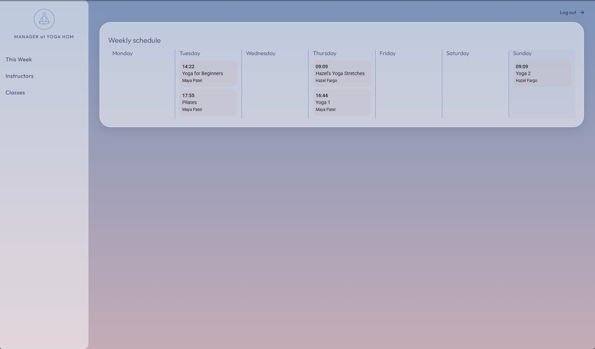
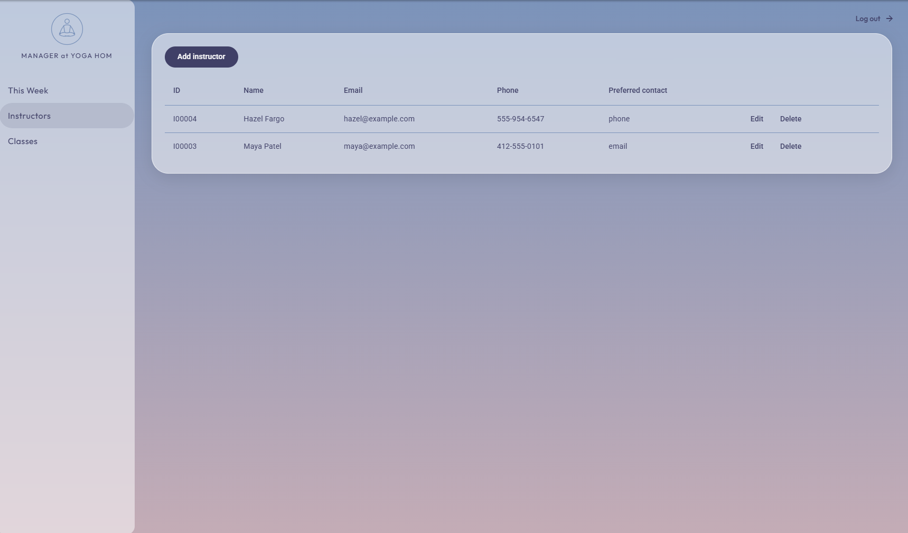
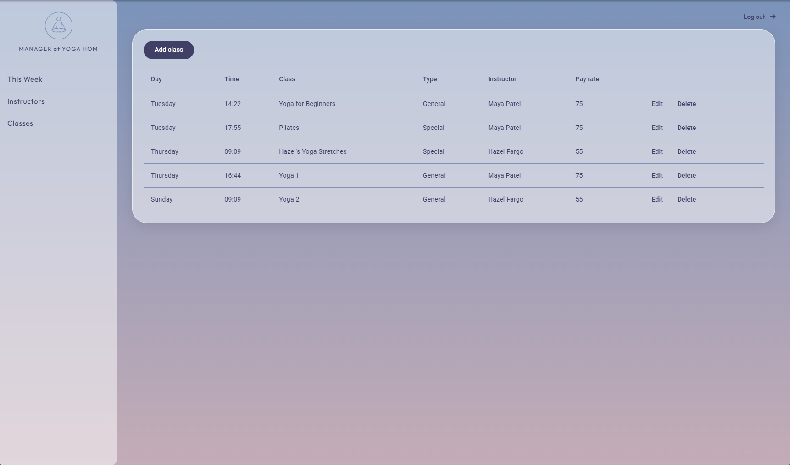

# Studio Yoga 'Hom

A web application for Yoga Hom Studio in Pittsburgh, PA. It replaces the studio's paper records with a system for managing instructors and classes now, and customers, packages, sales, attendance, and reports next.

**Live site:** https://lindsey-c-yoga-project-21bd18fc0ab6.herokuapp.com/

The site runs on a Heroku Eco dyno, so the first request after a quiet period can take a few seconds.


## Status

| Use case | Status |
|----------|--------|
| UC1 Add an instructor | Done |
| UC2 Add a class | Done |
| UC3 Add a package | Planned |
| UC4 Add a customer | Planned |
| UC5 Record a sale | Planned |
| UC6 Record class attendance | Planned |
| UC7 Generate studio reports | Planned |

Login works with a Manager account. Only a Manager can create, edit, or delete data. Instructor accounts are planned along with attendance.

| Schedule | Instructors | Classes |
|----------|-------------|---------|
|  |  |  |

## Tech stack

- **Frontend:** Angular 21 (standalone components), Angular Material, TypeScript
- **Backend:** Node.js, Express 5, TypeScript, Mongoose 9
- **Database:** MongoDB Atlas
- **Auth:** JSON Web Tokens, bcrypt password hashing, Manager and Instructor roles
- **CI/CD:** GitHub Actions and Heroku automatic deploys

Angular is used in place of React with the instructor's approval.

## Project structure

```
frontend/            Angular app
  src/app/pages/       Login, dashboard, instructors, classes
  src/app/services/    API calls and login state
  src/app/guards/      Route protection
  src/app/interceptors/  Adds the login token to requests
backend/             Express API
  src/app/routes/      URL to controller mapping
  src/app/controllers/ Request and response handling
  src/app/services/    Business rules
  src/app/models/      Mongoose schemas
  src/middleware/      Login checks and error handling
docs/                Project report and diagram images
.github/workflows/   CI pipeline
```

Every backend resource follows the path route, controller, service, model.

## Getting started

You need Node.js 24 and a MongoDB database, either local or a MongoDB Atlas connection string.

```bash
make install                          # install backend and frontend dependencies
cp backend/.env.example backend/.env  # then fill in the values below
make seed                             # create the first Manager login
make dev                              # API on :3000 and Angular on :4200
```

Open http://localhost:4200 and log in with the email and password you set for the Manager.

### Environment variables

Set these in `backend/.env`. The file is never committed.

| Variable | Purpose |
|----------|---------|
| `MONGODB_URI` | MongoDB connection string, including the database name |
| `PORT` | API port, 3000 by default |
| `JWT_SECRET` | Key used to sign login tokens |
| `SEED_MANAGER_EMAIL` | Email for the Manager that `make seed` creates |
| `SEED_MANAGER_PASSWORD` | Password for that Manager |

Running `make seed` again with the same email resets that Manager's password.

### Commands

| Command | What it does |
|---------|--------------|
| `make install` | Install dependencies in `backend/` and `frontend/` |
| `make dev` | Run the API and the Angular app together |
| `make backend` | Run only the API |
| `make frontend` | Run only the Angular app |
| `make build` | Build both apps |
| `make test` | Run both test suites |
| `make seed` | Create or update the Manager login |

## API

All routes are under `/api/v1`. Routes marked Manager also need a Manager login.

| Method | Route | Access |
|--------|-------|--------|
| POST | `/auth/login` | Public |
| GET | `/health` | Public |
| GET | `/instructors`, `/instructors/:id`, `/instructors/check-duplicate` | Logged in |
| POST, PUT, DELETE | `/instructors`, `/instructors/:id` | Manager |
| GET | `/classes`, `/classes/:id` | Logged in |
| POST, PUT, DELETE | `/classes`, `/classes/:id` | Manager |

## Tests

```bash
make test
```

The frontend has two unit tests. The backend has no automated tests yet.

## CI/CD and deployment

A GitHub Actions workflow (`.github/workflows/ci.yml`) installs, builds, and tests both apps on every push and pull request to `main`. Heroku is connected to the repository and deploys `main` automatically once CI passes.

In production one Heroku dyno runs the Express server, which also serves the built Angular app. Set these Heroku config vars:

| Variable | Value |
|----------|-------|
| `MONGODB_URI` | Atlas connection string, including the database name |
| `JWT_SECRET` | A long random string |
| `NODE_ENV` | `production` |

After the first deploy, create the Manager login by running this in a Heroku console, with `SEED_MANAGER_EMAIL` and `SEED_MANAGER_PASSWORD` set temporarily:

```bash
node backend/dist/scripts/seed.js
```

Remove those two variables afterward.

## Documentation

- [Project report](docs/PROJECT_REPORT.pdf) (source: [`docs/PROJECT_REPORT.md`](docs/PROJECT_REPORT.md)): use cases, design decisions, and UML diagrams
- [`PLAN.md`](PLAN.md): the original spec, including the data model, API design, and flows

## License

[PolyForm Noncommercial 1.0.0](LICENSE)
