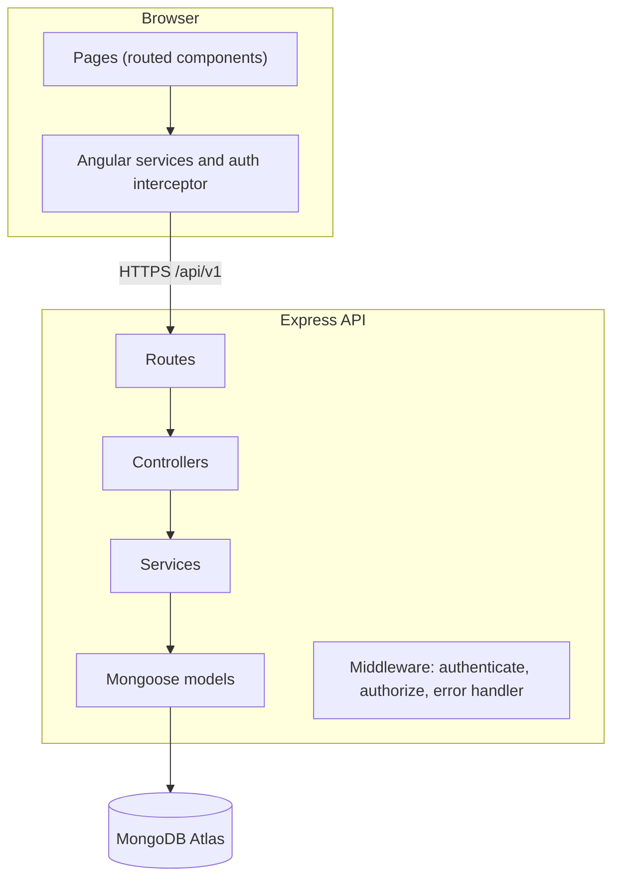
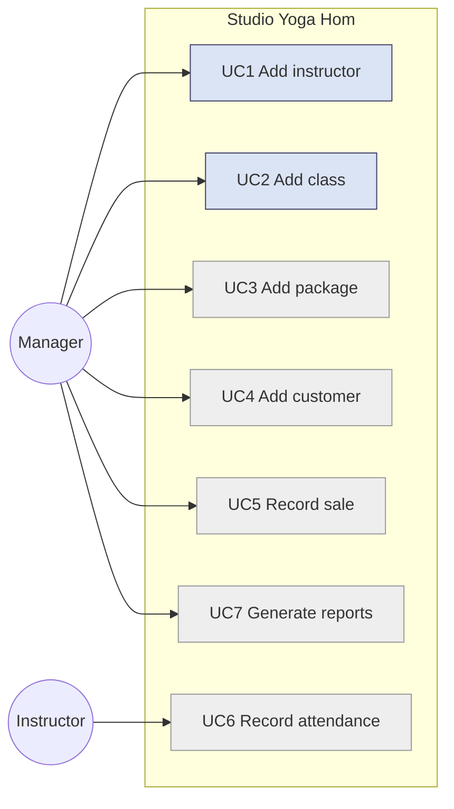
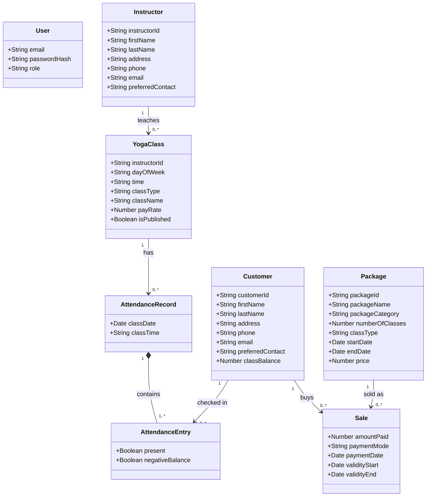
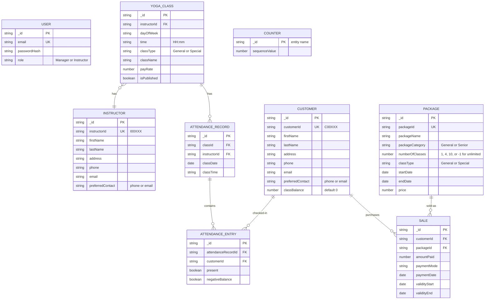
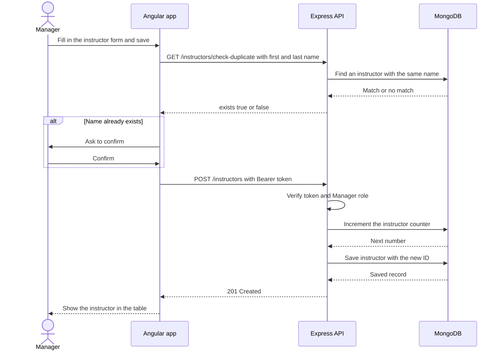
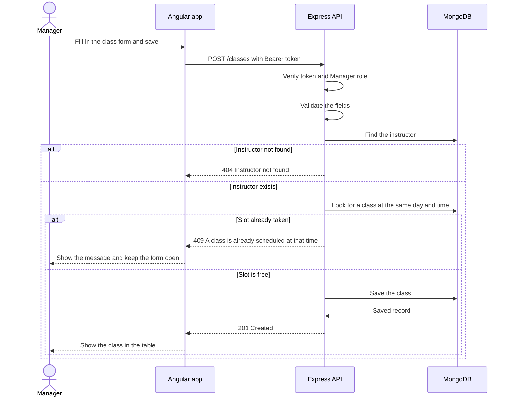
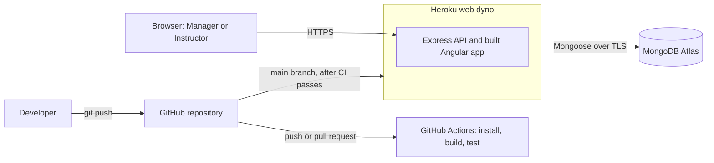
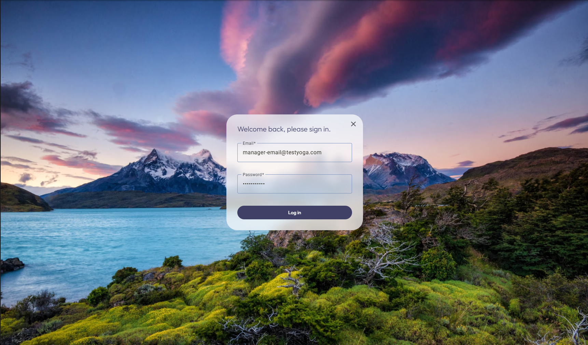

# Studio Yoga 'Hom — Project Report (Part 1)

Course: ACS-5423-999, Fall 2026

Author: Lindsey Choi

Live application: https://lindsey-c-yoga-project-21bd18fc0ab6.herokuapp.com/

Source code: https://github.com/lindseychoi/yoga-hom-project-lchoi

---

## 1. Introduction

Yoga Hom Studio is a small yoga studio in Pittsburgh, PA. It keeps its records on paper: instructors, customers, the class schedule, package sales, and attendance. Paper records are slow to search and easy to get wrong, and they can't produce the reports the studio needs, such as package sales, instructor check-ins, and monthly teacher pay.

Studio Yoga 'Hom is a web application that replaces those records. It has two kinds of users. A Manager runs the studio's data: instructors, classes, packages, customers, sales, and reports. An Instructor records attendance for their own classes. Customers are records the Manager keeps. They never log in.

Part 1 calls for a deployed application with at least two use cases, plus this report. I built use case 1 (add an instructor) and use case 2 (add a class). Both work on the live site behind a secure login, with access split by role. The app runs on Heroku with a MongoDB Atlas database, and a GitHub Actions pipeline builds and tests every change. The remaining use cases are designed in this report and planned for Part 2.

### 1.1 Technology stack

| Layer | Technology |
|-------|-----------|
| Frontend | Angular 21 (standalone components), Angular Material, TypeScript |
| Backend | Node.js, Express 5, TypeScript, Mongoose 9 |
| Database | MongoDB Atlas (free tier) |
| Authentication | JSON Web Tokens, with passwords hashed using bcrypt |
| CI/CD | GitHub Actions for build and test, Heroku automatic deploys |
| Hosting | One Heroku dyno. Express serves the API and the built Angular app |

The assignment specifies the MERN stack. I used Angular instead of React, with the instructor's approval by email on Sunday, September 6, 2026.

---

## 2. Requirements and use cases

### 2.1 Use case summary

| ID | Use case | Actor | Part 1 status |
|----|----------|-------|---------------|
| UC1 | Add an instructor | Manager | Implemented |
| UC2 | Add a class | Manager | Implemented |
| UC3 | Add a package | Manager | Planned for Part 2 |
| UC4 | Add a customer | Manager | Planned for Part 2 |
| UC5 | Record a sale | Manager | Planned for Part 2 |
| UC6 | Record class attendance | Instructor | Planned for Part 2 |
| UC7 | Generate studio reports | Manager | Planned for Part 2 |

### 2.2 UC1: Add an instructor

The Manager adds an instructor with a first and last name, address, phone, email, and a preferred way to be contacted (phone or email). As built:

1. The Manager opens the Instructors page and chooses Add instructor.
2. The Manager fills in the details. First and last name are required, and the email has to look like an email address.
3. On save, the app checks whether an instructor with the same name already exists. If so, it asks the Manager to confirm, since two people can share a name.
4. The server generates the instructor ID. It starts with `I`, for example `I00003`, so it can't be confused with a customer ID, which starts with `C`.
5. The server validates and saves the record, and the instructor appears in the table.

The Manager can also edit or delete an instructor from the same table.

Not built yet: the welcome message from the requirements ("Welcome to Yoga'Hom! ... Your instructor id is ..."). Sending notifications is planned for Part 2.

### 2.3 UC2: Add a class

The Manager adds a class to the weekly schedule with an instructor, a day and time, a class type (General or Special), a class name, and a pay rate. As built:

1. The Manager opens the Classes page and chooses Add class.
2. The Manager picks an instructor from the existing instructors and fills in the day, time, class type, name, and pay rate.
3. The server checks that the instructor exists and that no other class is at the same day and time, since only one class can run at any time.
4. If the slot is taken, the server refuses it and says so, for example "A class is already scheduled on Tuesday at 14:22". The form stays open so the Manager can pick another time.
5. Otherwise the class is saved and shows up in the class table and on the weekly schedule.

The server enforces these rules: the instructor must exist, the day is Monday through Sunday, the time is a 24-hour `HH:mm` value, the class type is General or Special, and the pay rate can't be negative. A database index also guarantees one class per slot, even if two Managers save at the same moment.

Not built yet: suggesting open slots when there's a conflict, and sending the confirmation message to the Manager and the instructor. Both are planned for Part 2.

### 2.4 Access control

<!-- VERIFY BEFORE SUBMITTING: Instructor login accounts must exist and work on the live site, and this section must match what a logged-in Instructor can actually do. Delete this note once checked. -->

Both roles sign in with an email and password. Every instructor and class route needs a valid login. Only the Manager can create, edit, or delete. An Instructor signs in with their own account and can read instructors and classes, but can't change them. A request with no token or a bad token gets a 401 response, and a request without permission gets a 403.

---

## 3. Architecture

The repository has two folders, `frontend/` for the Angular app and `backend/` for the Express API. The browser talks to the API over HTTPS, and the API stores everything in MongoDB. In production one Heroku dyno runs the Express server, which also serves the built Angular files, so there's a single thing to deploy.

*Figure 1. System architecture.*

### 3.1 Backend

Every resource follows the same path: route, controller, service, model. Routes map a URL to a controller and attach the login checks. Controllers read the request and send the response. Services hold the business rules, like generating IDs and checking for time conflicts. Models are Mongoose schemas that define and validate the data. One shared error handler turns errors into consistent JSON responses. A validation failure becomes a 400 with the field messages.

### 3.2 Frontend

The pages are Login, This Week (the dashboard), Instructors, and Classes. Each page keeps its template and styles in one file. Small services wrap the API calls, and an HTTP interceptor adds the login token to every request. Route guards keep logged-out visitors out of the app and send logged-in users past the login page. Angular Material provides the tables, forms, dialogs, and navigation.

### 3.3 Authentication

The user sends an email and password to `POST /api/v1/auth/login`. The server checks the password against its bcrypt hash and returns a token that carries the user's ID and role and expires after 8 hours. The Angular app stores the token, and the interceptor sends it on every request as `Authorization: Bearer <token>`. The server verifies the token's signature, and routes that change data also check that the role is Manager.

### 3.4 API endpoints

All routes are under `/api/v1`.

| Method | Route | Access |
|--------|-------|--------|
| POST | `/auth/login` | Public |
| GET | `/health` | Public |
| GET | `/instructors`, `/instructors/:id`, `/instructors/check-duplicate` | Logged in |
| POST, PUT, DELETE | `/instructors`, `/instructors/:id` | Manager |
| GET | `/classes`, `/classes/:id` (optional `?instructorId=`) | Logged in |
| POST, PUT, DELETE | `/classes`, `/classes/:id` | Manager |

---

## 4. UML models

### 4.1 Use case diagram

Blue use cases are built in Part 1. Grey ones are planned for Part 2.

*Figure 2. Use case diagram.*

### 4.2 Domain class diagram

*Figure 3. Domain class diagram.*

`User`, `Instructor`, and `YogaClass` are built. The rest are designed for Part 2.

### 4.3 Data model (ERD)

*Figure 4. Data model (ERD).*

The `COUNTER` collection generates the readable IDs. Each kind of record has one counter document that goes up by one for every new record, which gives IDs like `I00001` and `I00002`.

### 4.4 Sequence diagram: UC1, Add an instructor

*Figure 5. Sequence diagram for UC1, Add an instructor.*

### 4.5 Sequence diagram: UC2, Add a class

*Figure 6. Sequence diagram for UC2, Add a class.*

### 4.6 Deployment diagram

*Figure 7. Deployment diagram.*

---

## 5. Design decisions

| Decision | Why | Alternative I considered |
|----------|-----|--------------------------|
| Two plain folders, `frontend/` and `backend/` | Simple to understand and maintain for one developer | An Nx monorepo, which added tooling I didn't need |
| Layered backend: route, controller, service, model | Keeps business rules out of request handling, so they're easy to find | Putting logic in the route handlers |
| Validation in the Mongoose schemas, with the error handler returning 400 | One place defines what valid data is | A separate validation library, which repeated the same rules |
| JWT login with two roles | Works on a single dyno with no session storage, and lets me protect routes by role | Server-side sessions |
| Passwords stored as bcrypt hashes | A leaked database doesn't reveal passwords | None |
| Server-generated IDs from a counter (`I00001`) | Readable and sequential, and the letter tells instructors from customers | MongoDB's long default IDs |
| One class per day-and-time slot, checked in the service and enforced by a unique index | The service gives a clear message, and the index still guards against simultaneous saves | Checking only in the service |
| A class has one instructor, stored as `instructorId` | Matches the requirements and keeps the pay report simple | Several instructors per class, which the requirements don't describe |
| Duplicate instructor names warn but don't block | Two people can share a name, and the requirements ask for a confirmation prompt | Rejecting duplicates |
| Angular Material with the color palette in SCSS variables | Consistent, accessible components, and one place to change the look | Hand-written CSS for every component |
| Template and styles in one file per page | Fewer files and less boilerplate for small pages | Separate HTML and style files |
| One Heroku dyno serving the API and the built Angular app | One app and one URL, with no cross-origin setup | Hosting the frontend and backend separately |
| GitHub Actions for CI, Heroku automatic deploys for CD | No deploy credentials stored in GitHub, and nothing deploys unless the build passes | A deploy step inside the workflow |

---

## 6. Implementation and user interface

The look is a soft five-color palette kept in one SCSS file, with one block typeface throughout. The landing page is a full-screen photo with the studio name, a tagline, and a Login link that opens a translucent login card. Once logged in, the app has a gradient background, a translucent sidebar that shows the signed-in role (for example "MANAGER at YOGA HOM"), and a translucent content panel. The screens use Material tables, dialogs, and form fields. Text and spacing scale with the window, and the weekly schedule drops from seven columns to one on narrow windows. The layout isn't fully tuned for small phone screens yet.

*Figure 8. Landing page.*

*Figure 9. Login card.*

*Figure 10. This Week, the weekly class schedule, with today's column highlighted.*

*Figure 11. Instructors page, where the Manager adds, edits, and deletes instructors.*

*Figure 12. Classes page, where the Manager schedules classes.*

The Instructors and Classes pages are tables with Add, Edit, and Delete. The form opens as a dialog. On the Classes page, a time-slot conflict shows the server's message and leaves the form open so nothing has to be retyped.

---

## 7. CI/CD and deployment

A GitHub Actions workflow (`.github/workflows/ci.yml`) runs on every push and pull request to `main`. It installs both apps, builds them, and runs both test suites. If a step fails, the commit is marked as failing.

Heroku is connected to the repository with automatic deploys from `main`. When a change lands on `main`, Heroku builds the app and deploys it. A root `package.json` tells Heroku how to build the frontend and backend and start the server. The app reads its settings (`MONGODB_URI`, `JWT_SECRET`, and `NODE_ENV=production`) from Heroku config vars, so no secrets are in the repository.

The live database is a MongoDB Atlas free-tier cluster with a dedicated database user. Logging in on the live site requires a Manager account, which I created with a seed script after the first deploy.

---

## 8. Testing

CI builds both apps and runs the tests on every change, which catches compile errors before they deploy. The frontend has two unit tests: one checks that the app starts, and one checks that a logged-out visitor doesn't get the logged-in layout. The backend has no automated tests yet. I tested login, instructors, and classes by hand in the browser and with an API client, including failed logins and requests without a token. Automated tests for ID generation, the class conflict rule, and access control are the first thing I'd add in Part 2.

---

## 9. Use of AI

The course allows AI assistance, which I confirmed with the instructor. I used Claude Code as a pair-programming partner for planning, scaffolding, and implementation. I set ground rules in the repository (`CLAUDE.md`): it had to ask before changing files, couldn't add packages without asking, and had to keep changes small. I reviewed each change before it went in and ran the results myself.

The design decisions were mine, and several went against its first suggestion. I rejected a large monorepo setup for two plain folders. I rejected splitting the app across several free hosts, because the assignment calls for one deployment. I chose Angular Material over hand-built CSS and directed the look of every page, including layout, colors, fonts, and wording. I dropped a separate validation library because it repeated what the database schemas already enforce. I reverted to one instructor per class after checking the requirements, which say "Instructor Id" in the singular. I chose Heroku's automatic deploys over a deploy step in the workflow. The earlier decisions are logged in `PLAN.md`, section 11.

---

## 10. Limitations and next steps

Still to build for Part 2:

- Use cases 3 to 7: packages, customers, sales, attendance, and the four reports.
- Sending the welcome and check-in messages.
- Suggesting open time slots when a class conflicts.

Known gaps:

- Test coverage is thin, and the backend has none.
- The layout isn't tuned for small phones, and the frontend bundle is over the default size budget.
- The landing photo is large and slows the first load.
- There's no sign-up or password reset. Accounts are created by an administrator.
